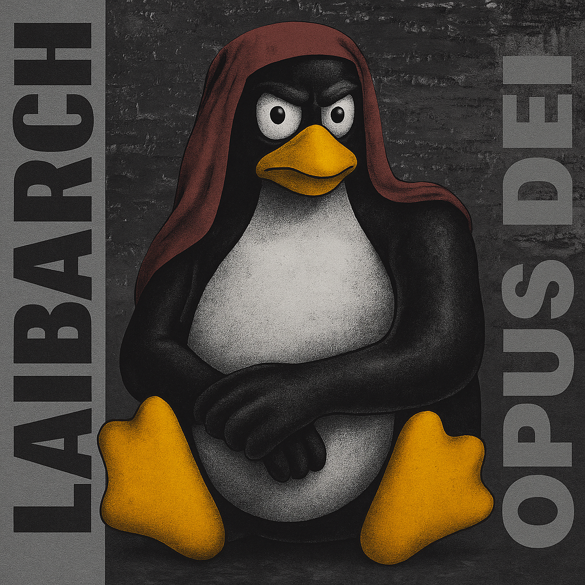
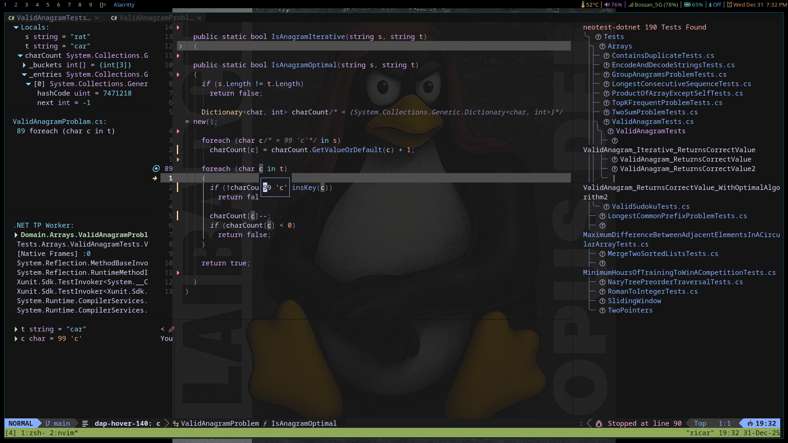
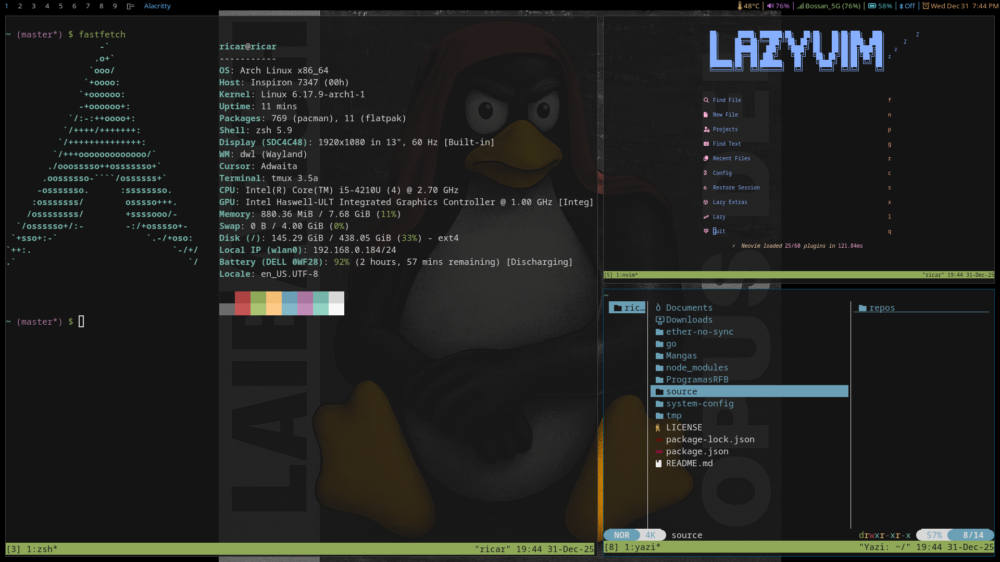

# Laibarch

~~Life~~ Arch is Life!



My Arch Linux rice. DWL window manager, LUKS encryption, automated installation.

📖 **[User Guide](.local/share/ricing/USER-GUIDE.md)** - Essential keyboard shortcuts and system usage

## Quick Install

### 1. Create ISO

```bash
bash .local/share/ricing/create-repo-iso.sh
```

### 2. Boot & Install (from Arch Live ISO)

```bash
mount /dev/sr0 /mnt/repo  # or sr1, check with lsblk
bash /mnt/repo/.local/share/ricing/laibarch-install.sh
```

**Phase 1** (auto-detected): Partitioning, LUKS encryption, base system, bootloader.

### 3. After Reboot (login as root)

```bash
mount /dev/sr0 /mnt/repo
bash /mnt/repo/.local/share/ricing/laibarch-install.sh
```

**Phase 2** (auto-detected): User creation, package installation, DWL build, service setup.

### 4. Done

Reboot and DWL starts automatically.

## Features

- **Automated** from bare metal to working system in [two phases](.local/share/ricing/README.md)
- **Full disk encryption** with LUKS
- **DWL** Wayland compositor with custom bar patch
- **Wayland-native** stack (no X11 dependencies except slstatus)
- **Status bar with clickable widgets** for:
  - Temperature
  - volume
  - network
  - battery
  - bluetooth
  - calendar
- **TUI applications** predominance (lazygit, neovim, sqlit, etc)
- **Blue light filter** with automatic geolocation (geoclue + gammastep)

## Repository Structure

This is a **home directory git repository**. The entire `$HOME` is tracked with selective `.gitignore`:

```
~/                              # Git root
├── .config/                    # Config files
│   ├── alacritty/
│   ├── nvim/
│   ├── systemd/user/          # User services (battery/temp monitors)
│   ├── tmux/
│   └── zsh/
├── .local/
│   ├── bin/                   # User scripts
│   │   ├── battery-monitor.sh
│   │   ├── brightness.sh      # Universal brightness (laptop + desktop)
│   │   ├── dwl-autostart.sh
│   │   ├── dwl-status-click.sh
│   │   └── temp-monitor.sh
│   ├── share/ricing/          # Installation scripts
│   │   ├── laibarch-install.sh
│   │   ├── programs.txt       # Package list
│   │   └── scripts/
│   └── src/                   # Patched sources
│       ├── dwl/               # DWL with bar patch
│       └── slstatus/          # Status bar (will migrate to dwlb)
├── system-config/             # System configs (geoclue, etc.)
└── README.md                  # This file
```

## What Gets Installed

### Core System

- **Window Manager**: DWL (Wayland) with custom bar (clickable widgets)
- **Terminal**: Alacritty + Tmux (auto-starts)
- **Shell**: Zsh (default) + Bash (fallback)
- **Network**: iwd + NetworkManager (iwd backend)
- **Audio**: PipeWire + WirePlumber

### Development

- **Editor**: Neovim 0.10.4 (from binary)
- **Languages**: C#, Node.js, Python
- **Tools**: Git, GitHub CLI, Lazygit, sqlit, lazysql



### Applications

- **Browser**: Brave
- **Media**: mpv, mupdf, ncmpcpp
- **Utils**: Obsidian, Syncthing, Calcurse, yazi
- **AUR**: yay (built during install)



### Optional (Phase 2 prompts)

- **Gaming**: Steam (Flatpak), Slack (AUR)

See `programs.txt` for complete list (93 packages).

## Hardware Support

### Brightness Control

Works on both laptops and desktops:

- **Laptops**: Uses `brightnessctl` (built-in backlight)
- **Desktops**: Uses `ddcutil` (DDC/CI protocol for external monitors)
- Keybindings: `MODKEY+Shift+-` / `MODKEY+Shift+=`

### Temperature Monitoring

Shows highest temperature across all devices:

- **Desktop**: Monitors CPU (k10temp), GPU (amdgpu), NVMe
- **Laptop**: Falls back to ACPI thermal zones
- Click widget for detailed temps

### Tested On

- VMs (libvirt/QEMU with `/dev/vda`)
- NVMe systems (`/dev/nvme0n1`)
- SATA systems (`/dev/sda`)
- AMD Ryzen 9 7900 + RX 6750 XT
- Dell 7347 laptop

## Post-Installation

After laibarch installation completes, the system is fully functional with:

- ✅ DWL compositor running
- ✅ Network connected (WiFi credentials persist)
- ✅ All services enabled
- ✅ User services monitoring battery/temperature
- ✅ Auto-login enabled (no password after LUKS unlock)

### Optional Next Steps

You may want to add:

- SSH/GPG keys for git access
- Personal dotfiles and configs
- Password managers and secret storage
- Additional applications

## Documentation

Detailed documentation in [.local/share/ricing/README.md]:

- Installation workflow details
- Script descriptions
- VM vs hardware setup
- Terminal stack architecture
- Security considerations

## Security

- LUKS encryption with user-chosen password (required on boot)
- Auto-login enabled after LUKS unlock (convenience)
- No hardcoded credentials
- Safe for public sharing

Tested on VMs and hardware. Contributions welcome!

---

*Laibarch name and mascot are inspired by Laibach. Not affiliated. Original artwork rights belong to their respective owners.*
